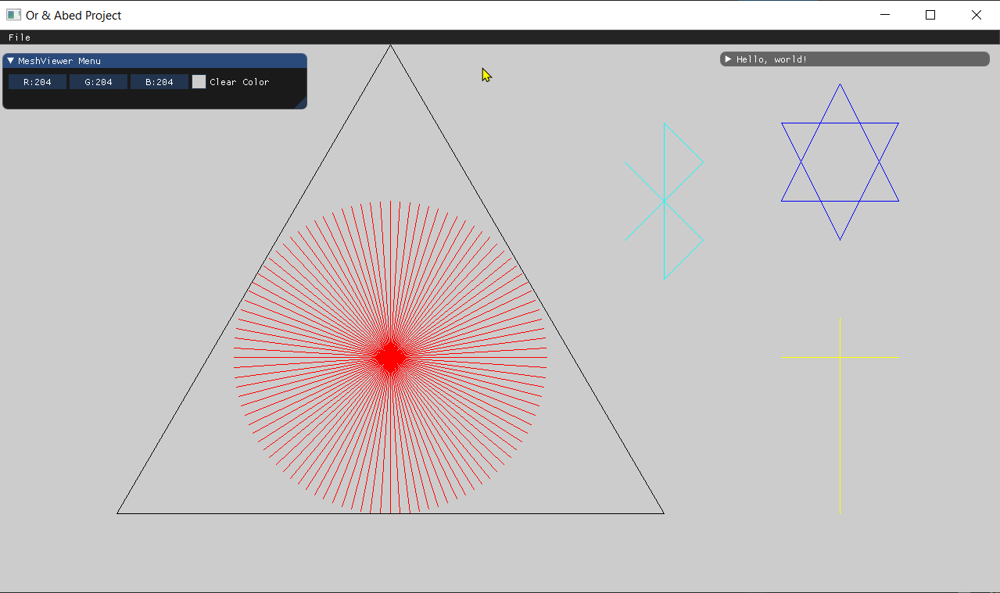
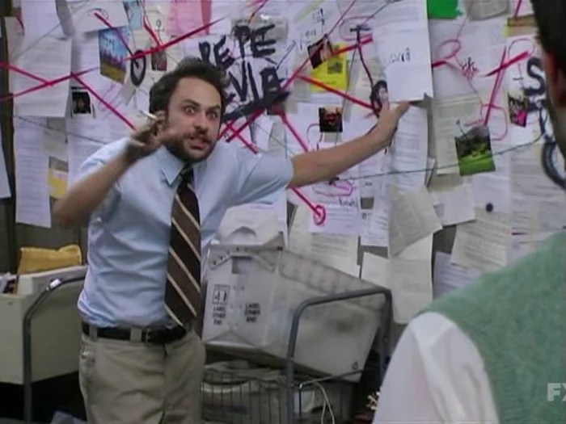

Assignment #1 Wireframe Viewer Line Drawing

1- Our implementation of the Bresenham’s algorithm

```
void Renderer::DrawLine(const glm::fvec2& p1, const glm::fvec2& p2, const glm::vec3& color)
{

	// TODO: Implement bresenham algorithm
	// https://en.wikipedia.org/wiki/Bresenham%27s_line_algorithm

	int x0 = (int)p1[0], y0 = (int)p1[1];
	int x1 = (int)p2[0], y1 = (int)p2[1];

	if (std::abs(y1 - y0) < std::abs(x1 - x0)) {
		if (x0 > x1)
		{
			plotLineLow(x1, y1, x0, y0,color);
		}
		else
		{
			plotLineLow(x0, y0, x1, y1, color);
		}
	}
	else
	{
		if (y0 > y1) {
			plotLineHigh(x1,y1,x0,y0, color);
		}
		else
		{
			plotLineHigh(x0,y0,x1,y1, color);
		}
	}
}


void Renderer::plotLineLow(int x0, int y0,int  x1, int y1, const glm::vec3& color)
{
	int diffX = x1 - x0;
	int diffY = y1 - y0;

	int yi = 1;

	if (diffY < 0) {
		yi = -1;
		diffY = -diffY;
	}

	int d = (2 * diffY) - diffX;
	int y = y0;

	for (int x = x0;x <= x1; x++) {
		PutPixel(x, y, color);
		if (d > 0) {
			y = y + yi;
			d = d + (2 * (diffY - diffX));
		}
		else
		{
			d = d + 2 * diffY;
		}
	}
}

void Renderer::plotLineHigh(int x0, int y0, int x1, int y1, const glm::vec3& color)
{
	int diffX = x1 - x0;
	int diffY = y1 - y0;

	int xi = 1;

	if (diffX < 0) {
		xi = -1;
		diffX = -diffX;
	}

	int d = (2 * diffX) - diffY;
	int x = x0;

	for (int y = y0; y <= y1; y++) {
		PutPixel(x, y, color);
		if (d > 0) {
			x = x + xi;
			d = d + (2 * (diffX - diffY));
		}
		else
		{
			d = d + 2 * diffX;
		}
	}
}
```

2 +3 - present a photo to show creativity and the requested circle  


What the work flow really looked like...  



