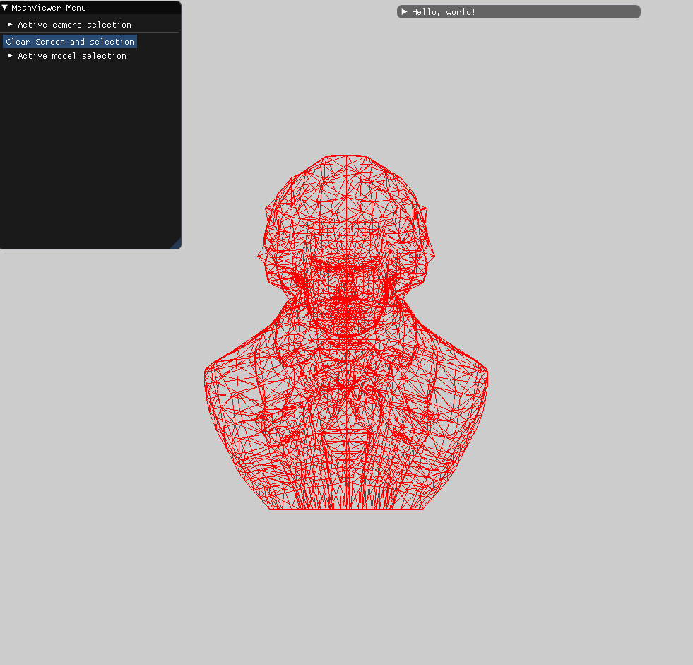

## Mesh vertices and faces

## Scale and translate the vertices

###### Translating 

we want to know the center of the object and change its center such that it center will be at the origin of the coordinate system.

We went through a loop on all vertices and concluded the max min value for each dimension ,then we performed  (min + max)/2 , this gave us the center points between the farthest points in each dimension, after performing this for each dimension you get a point Vc,  this points represent the center , we want the center to be in V0 = (0,0,0) to do that we need to translate  the object , we create a vector (V0 - Vc) , we transform this vector to a translate transformation and apply it to the model.

###### Scaling

we wanted the object to be half the size of the screen , that means is our screen  is x* y then the model will have to be inside a bounding box of size x/2* x/2 (we take the minimum of x, y lets assume x<=y ) , in order to do that we need to know the longest distance between two points in the model in order to know how much to scale it.

we will loop through the vertices and git the min max of each dimension,  we find the delta  = (max - min) and we take the maximum delta of the three dimensions lets call it deltaMAX,  then we know the longest distance between two points, to scale the longest distance to equal to the bounding box we calculate: 

deltaMAX * scale  = bounding_box_length

scale = bounding_box_length /deltaMAX 

then we multiply all the vertices with the scaling transformation.

###### After transformation

we wanted for the  transformation to be displayed in the center of the screen , so after Appling all the transformation from the GUI we apply the translating transformation which we add (x/2,y/x,0) for all vertices.

## Renderer object

## GUI

the GUI is representing in tree structure, the user has to load a model, once is it loaded the GUI selects it as the active model and two option is opened, Object transformation and World transformation, each are identical GUI wise. each transformation has three options , scaling [2,-2] , rotating [-180 ,180] , translating [ -windowSize/2 ,windowSize/2].

## loading several models

The user can select the active model he want to work on by clicking the model name in the GUI and then choosing the transformation.

each object remembers his own parameters and thus transition between object is seamless.