##  Rotating the model

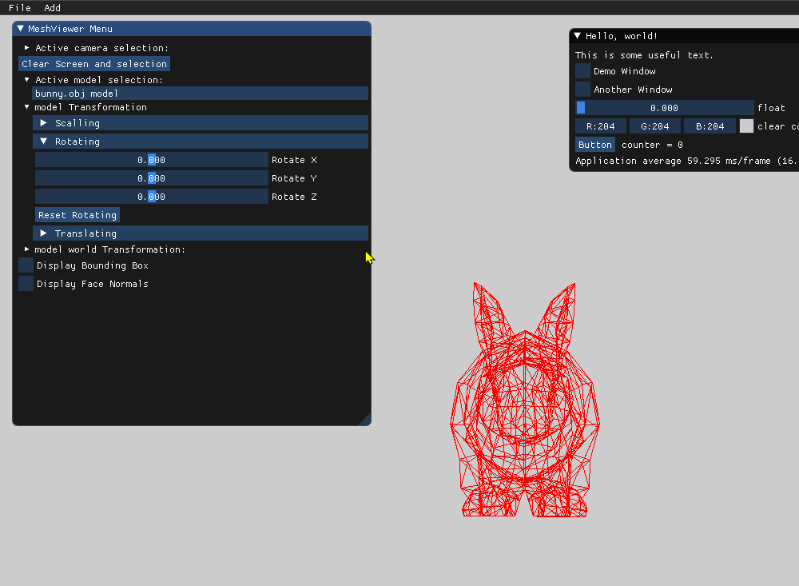

Here we demonstrate rotating the model in X,Y,Z axis.

## world vs local transformation

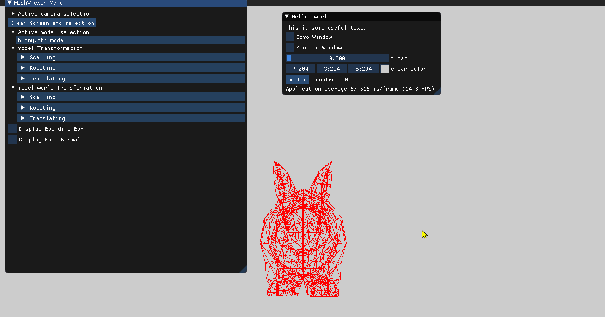

we picked two transformation:

T1 = rotating model around Y axis.

T2 = translating the object ;

#### T2 * T1 

We first show how when applied T1 first and then T2, we get we rotate around the model center and then we can move the model in world space. 

#### T1 * T2 

when applied T2 first and then T1, the model is translated to a place and then rotated around the world center and note around the model.

## Bounding Box, vertex normal, face normal

Here we show the Bounding Box, vertex normal, face normal , before and after applying the transformation.

## orthographic projection vs. the perspective projection.

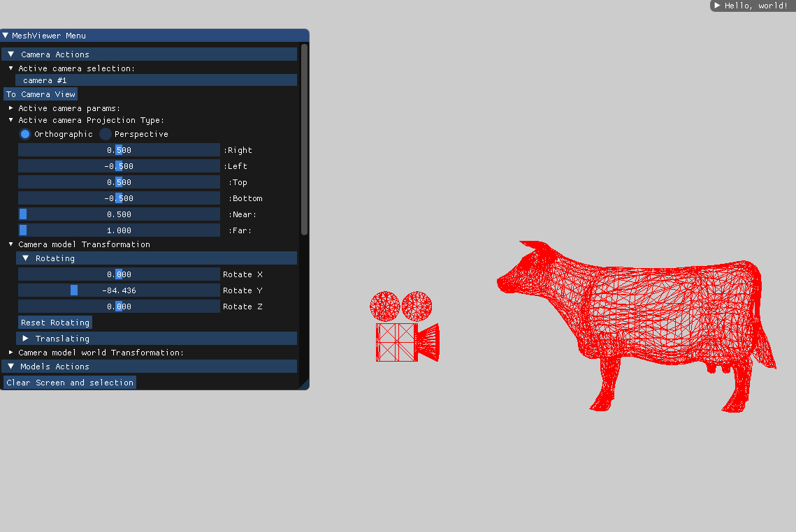

We show the difference between the orthographic projection the perspective projection, we can see when switching between the projections that the perspective projection is showing the cow's behind proportionally as more smaller than its front and that  is because its relative distance  to camera changes, compared to the orthographic  projection where the whole model is the same size .

## changing the zoom

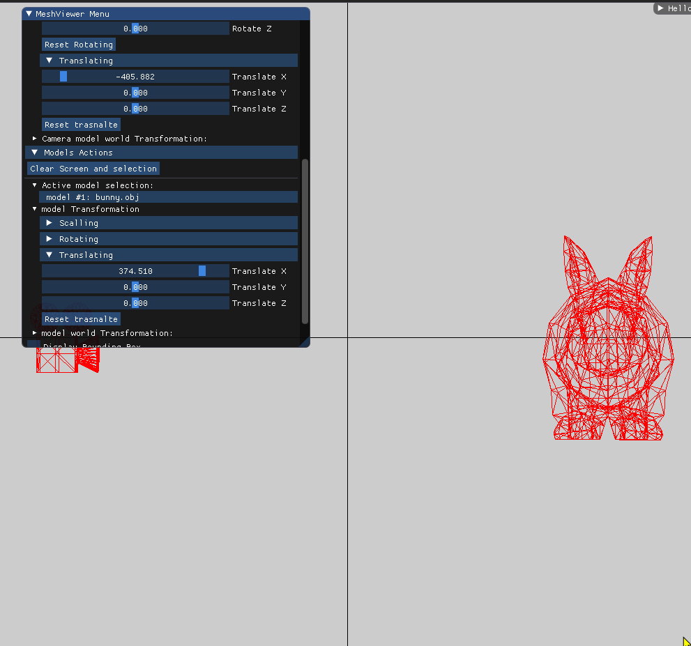

Changing the zoom in orthographic .

## Rotate the camera in the camera’s frame around they(up) axis

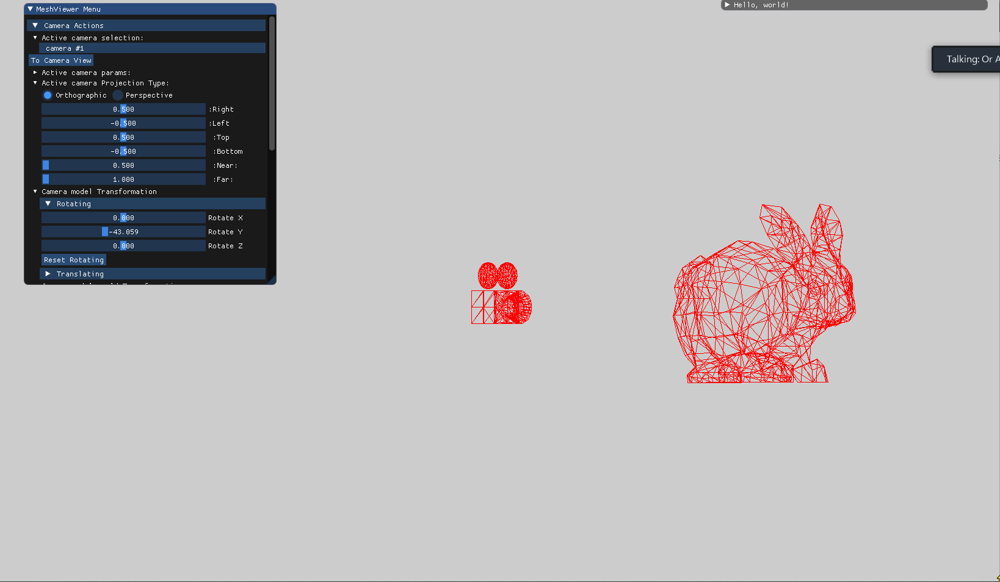

## Using LookAt

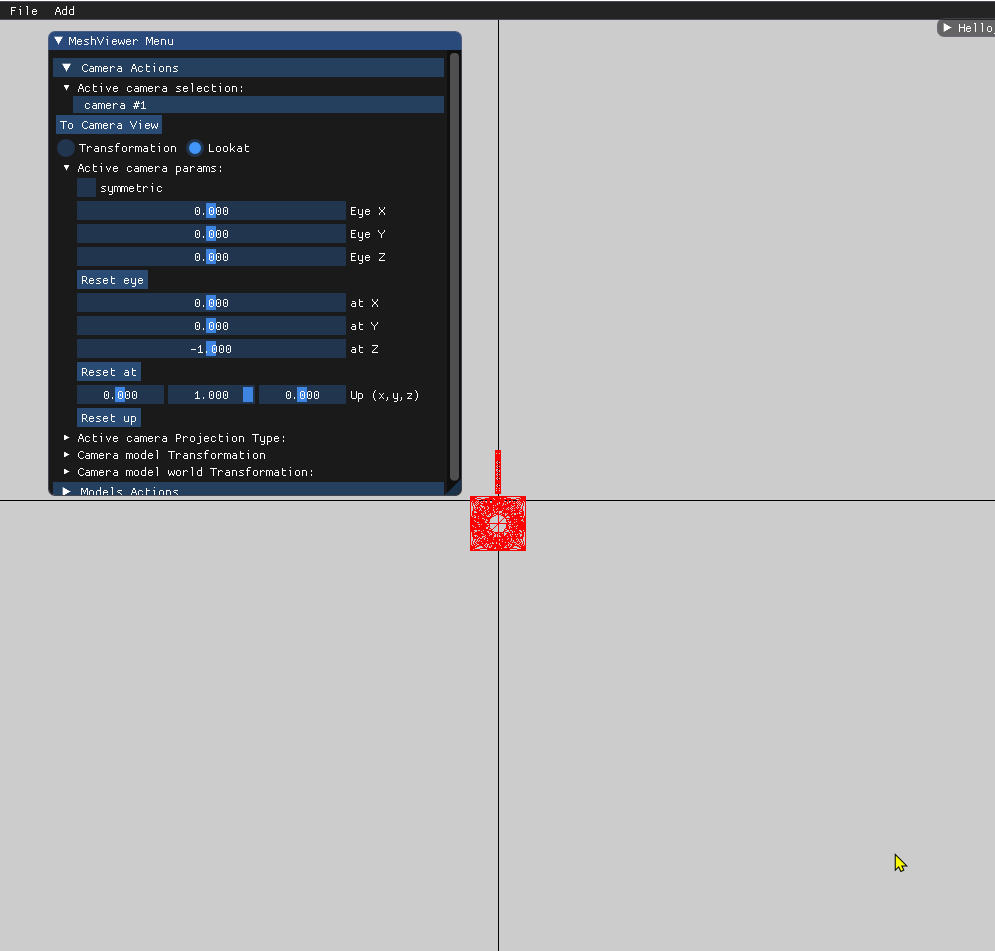

## Multiple models and cameras 

#### Pikachu beethovenin Poké Ball

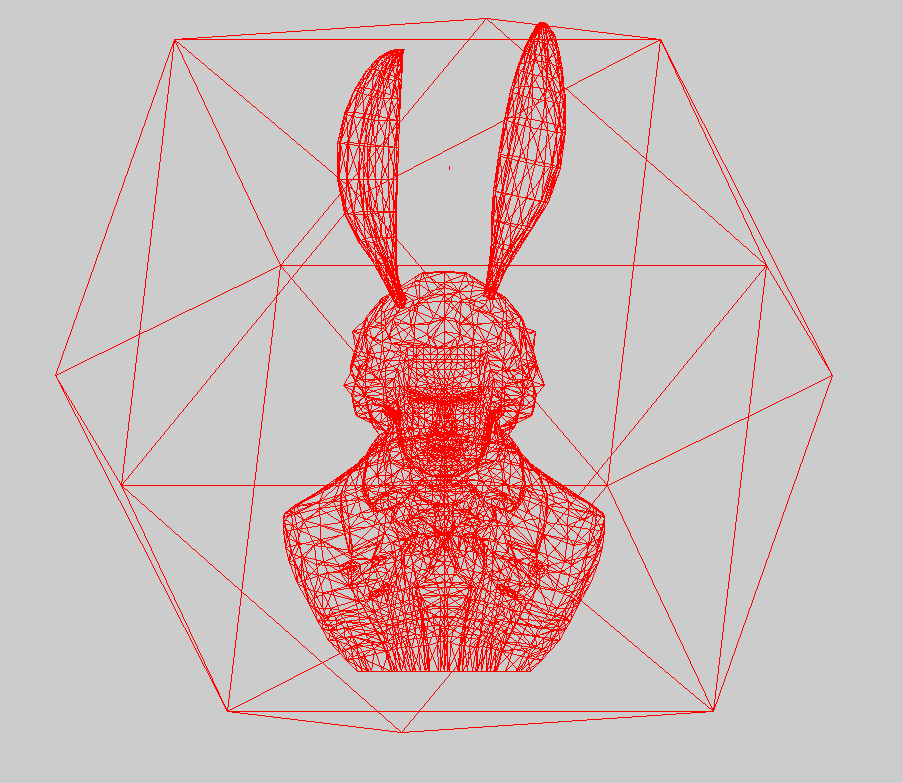

#### Animals On The Runway 

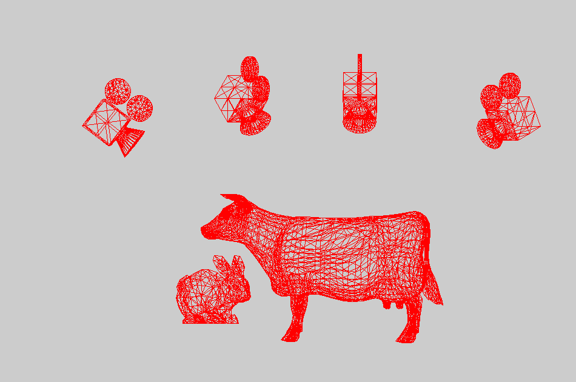

**All rights reserved**. No part of this publication  of the **Art** may be reproduced, distributed, or transmitted in any form or by any means, including photocopying, recording, or other electronic or mechanical methods, without the prior written permission of the publisher, except in the case of brief quotations embodied in critical reviews and certain other noncommercial uses permitted by copyright law. For permission requests, write to the publisher, addressed “Or and Abed: Professional goofballs”.

## window resizing 

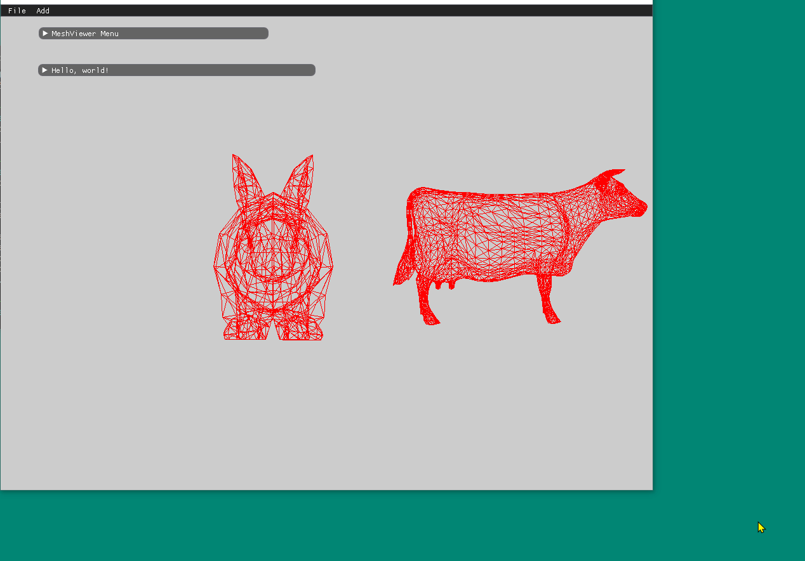

## Gui

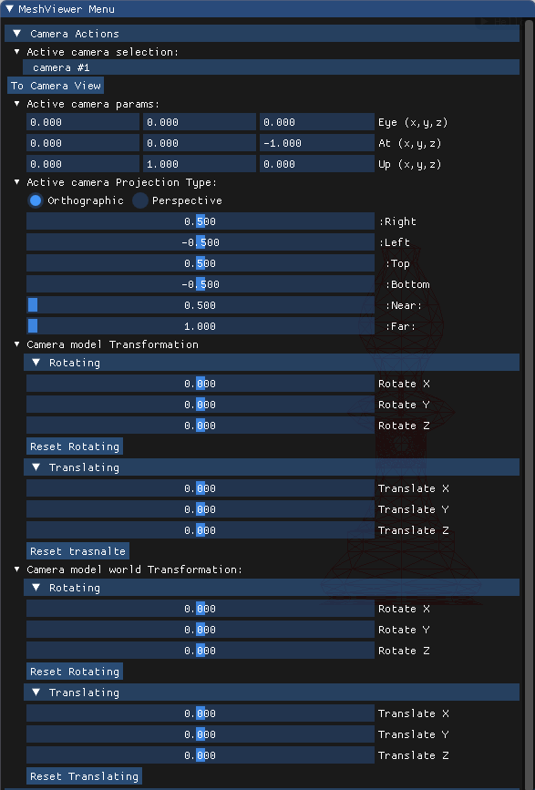 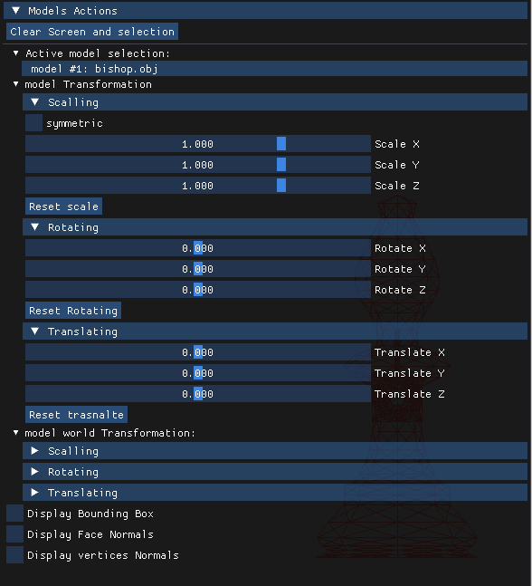

 

