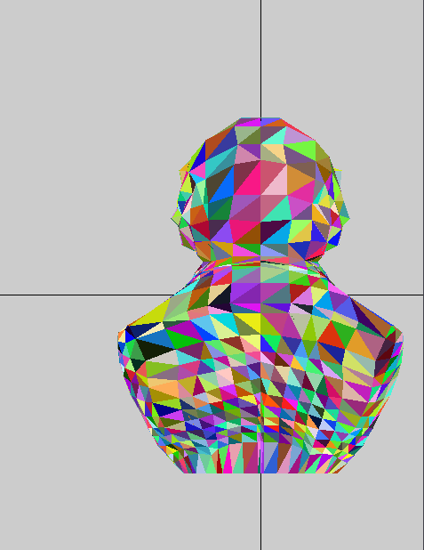

## color buffer

## Color Buffer & Z-Buffer

 

We have the color buffer without the z buffer on the left and with z buffer on the right. We can see in the left image the horror that is Beethoven Frankenstein (he has eyes on his back) but on the right you can see that  Beethoven is facing away from you.

we can see that in the picture of the teapot  in the left , the handle is visible though it shouldn't be . after applying  the z buffer algorithm we can see that the handle no longer visible as it should be.