## Light Types

### Ambient

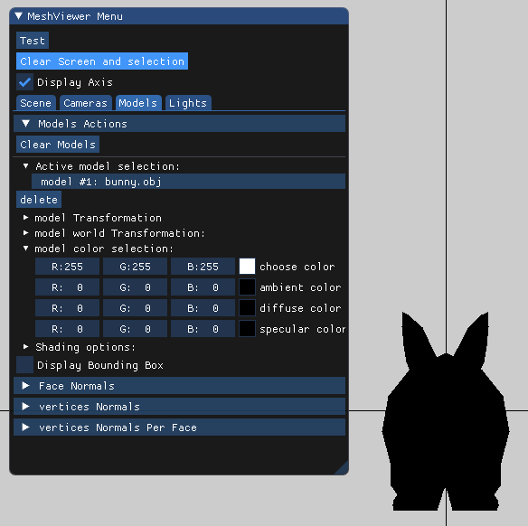  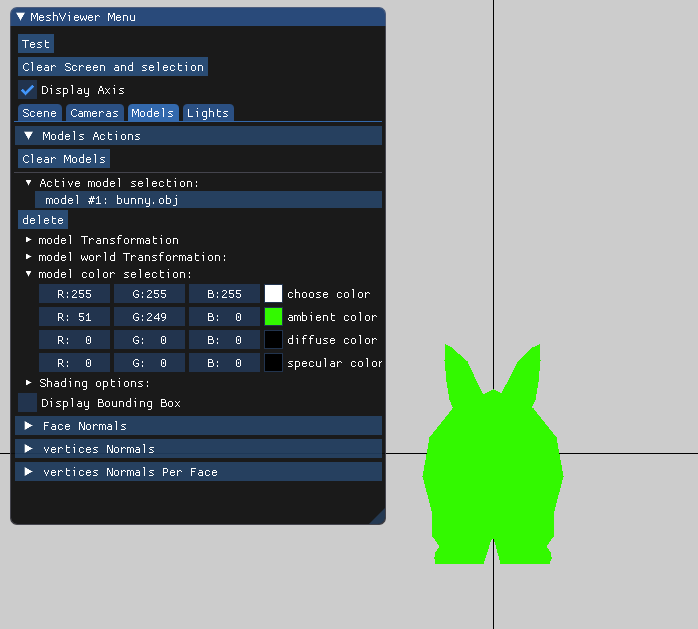

Here we demonstrate the ambient light,  it works by multiplying the  ambient colors of light and model, because it work  the same way on point and parallel light it will show the same behavior.

### Diffuse 

#### Parallel light

 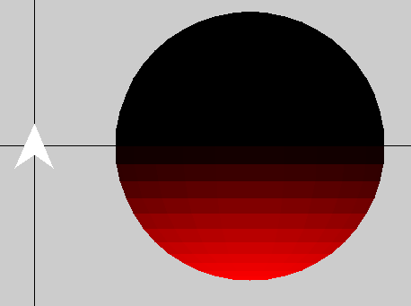 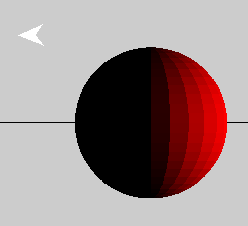

Diffuse color with Parallel light. We can see that the light is in the shape of an arrow indicating the direction of the light. The direction is the normal of the plane which created by the parallel light source. Applying translate transformation on the light source does not change the direction of the light, and thus no changes on the sphere. The  light should always cover half of the sphere.

#### Point light

 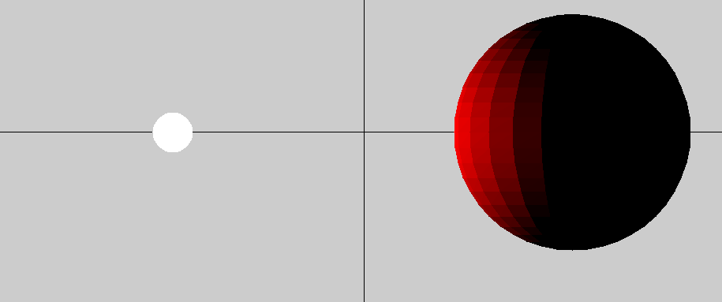 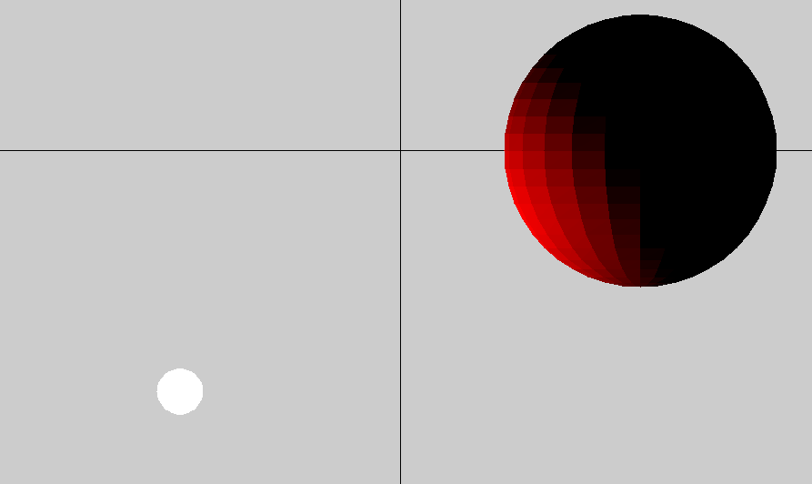  

Diffuse color with point light. We can that the light is in the shape of a sphere because the light emits lights in every direction. We can see that whenever we translate the point lights source the sphere color changes,  but whenever we rotate the point light source the colors remain the same.

### Specular

#### Parallel light

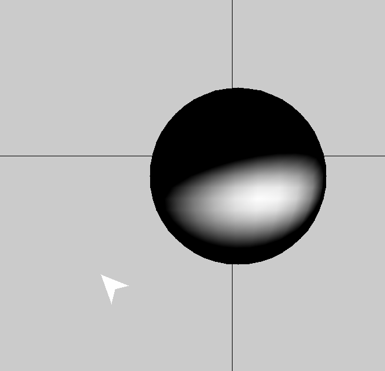

Here we have the specular light with a parallel light .

#### Point light

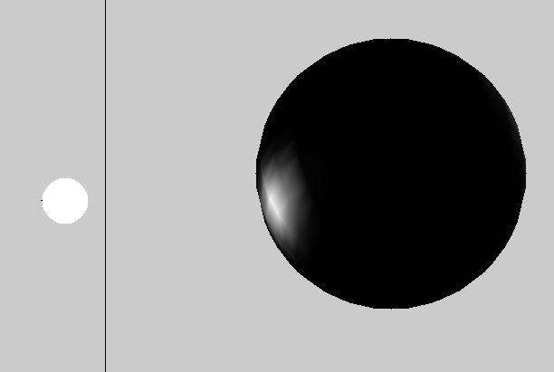

Here we have the point light with a parallel light .

## Materials

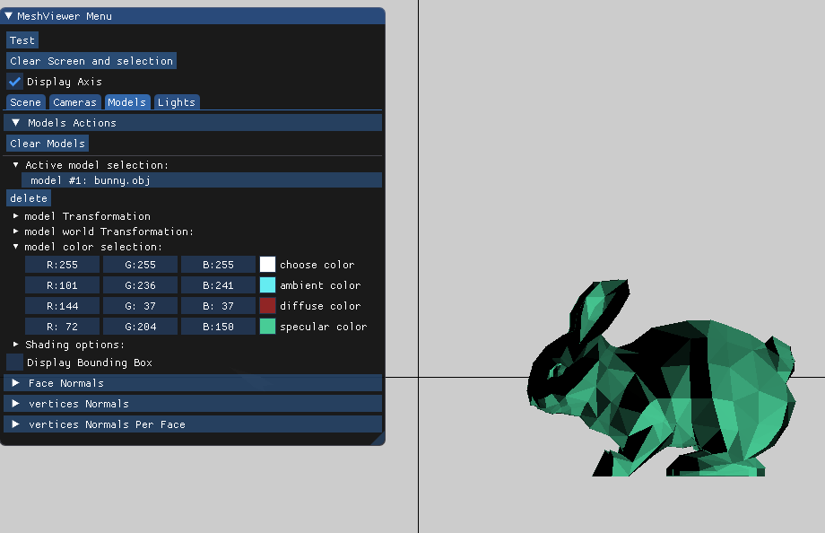

We gave the user the options to choose material colors for the model.

## Shading types

### Flat

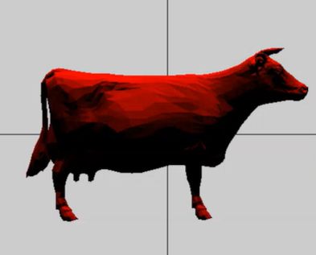 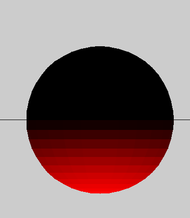

We use the triangle center to color the the faces and use tringle centers to calculate colors,

### Gouraud

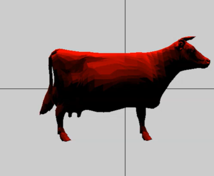 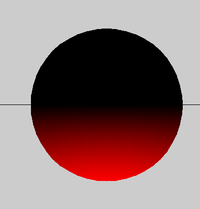

We interpolate on the face using  three colors calculated using  three varices constructing the face and using normals per vertex per face.

### Phong

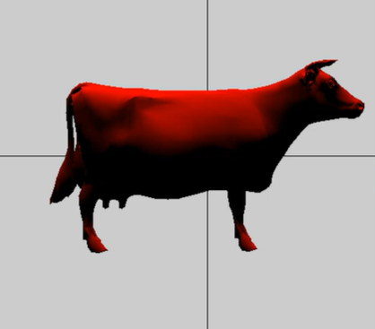 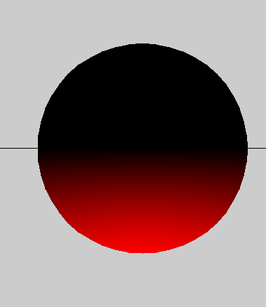

We interpolate nomrals of the three vertices constructing the face,and then we calculate the normal for each point on tringle and calculate color using new normal.

## Demonstration

### What's Up, Doc?

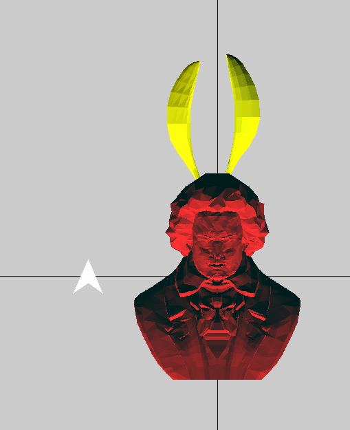 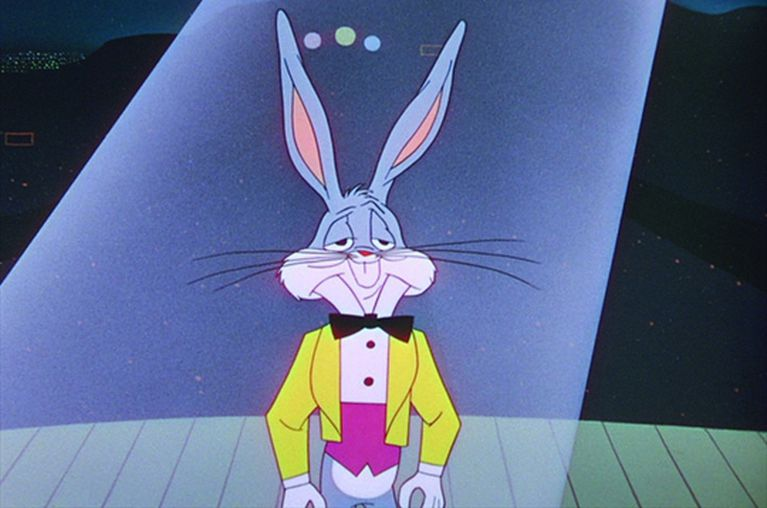

Phantom of the opera ? more like bugs bunny of the opera , we have diffuse light with ambient light with the combination of the white light to  give you this masterpiece. 

### It's Over 9000!

 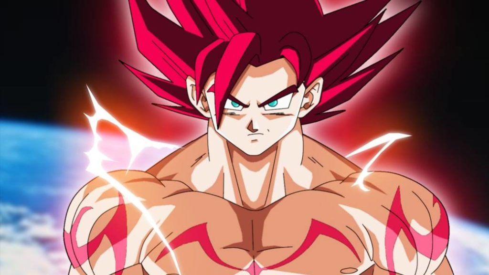

Super Saiyan  God Beethoven evolves into Pikachu . we used specular with diffuse and a little spice of ambient for Beethoven  and for the bananas we used only diffuse and ambient light because banana is not specular although its spectacular .

### Power of a million faces

specular and diffuse light used to display this monster of computation complexity.

### Simple is beautiful

 

specular and diffuse light used, when you just want a cup of tea but there is only tea and no cup.

### Animals at the disco 

 

background color change with diffuse and specular light, sphere and cow is in flat shading, dolphin is in Gouraud shading and bunny is in phong shading, on the right we have fog effect. Time to boogie like its 1969. 

### Beethoven new mix cover art

 

diffuse lighting with background color change, we can see Beethoven behind the scenes getting ready to drop his new sick mixtape, Symphony No. 10, soon available on Spotify and Apple music,  get your copy soon.  

### Multiple lights sources

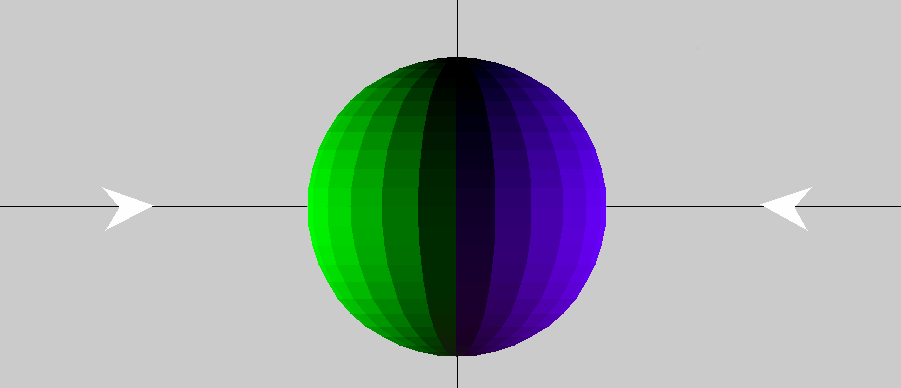 

we show multiple light using parallel light.

## Post Processing Effects

### Bloom + Gaussian Blur

 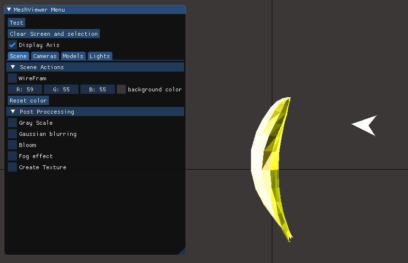  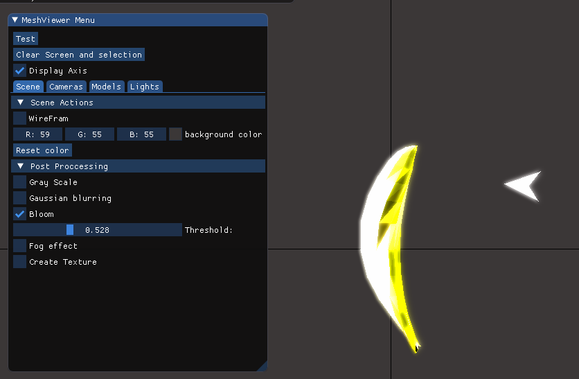  

We allow the user to choose the threshold. Lower threshold means more ✨shinny✨ objects. source image on the left bloom effect on the right.

### Fog Effect

 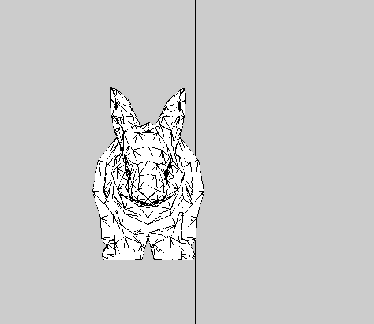

Here we can see the original pictures.

#### Linear

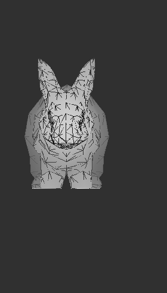

Users can choose the start and end of fog effect.

#### Exponential 

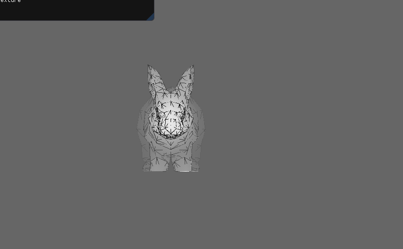

Users can choose density of the fog.

#### Exponential Squared 

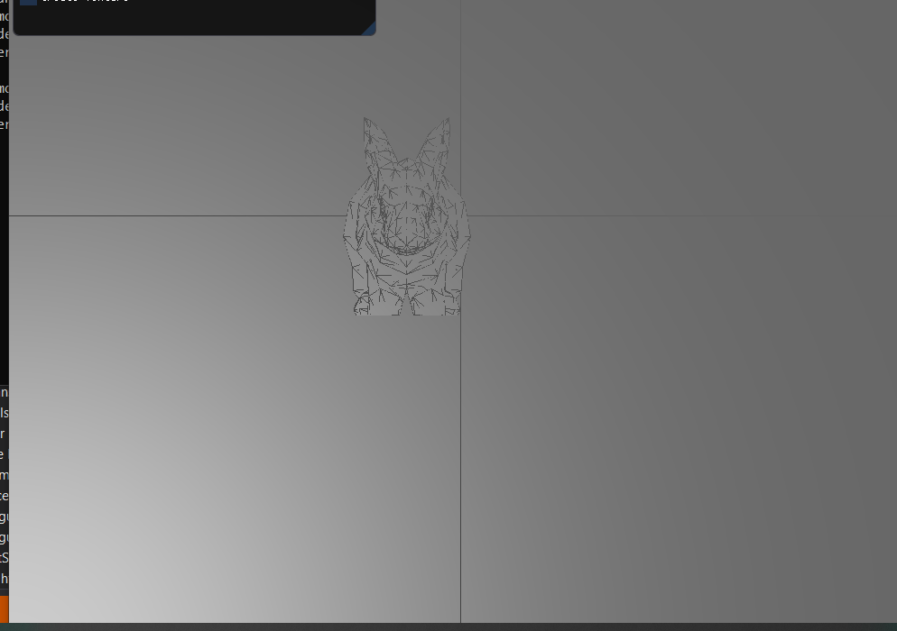

Users can choose density of the fog.

### Procedural textures 

We give the user the option to choose the intensity factor for the procedural textures.