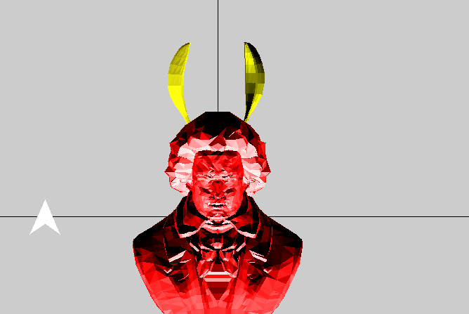
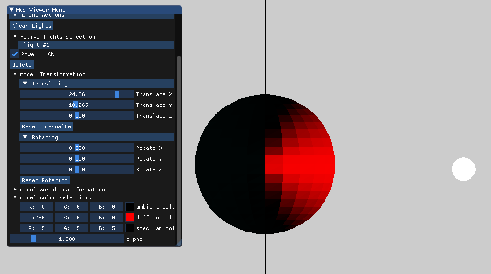

## Light Types

### Ambient

  

Here we demonstrate the ambient light,  it works by multiplying the  ambient colors of light and model, because it work  the same way on point and parallel light it will show the same behavior.

### Diffuse 

#### Parallel light

 

Diffuse color with Parallel light. We can see that the light is in the shape of an arrow indicating the direction of the light. The direction is the normal of the plane which created by the parallel light source. Applying translate transformation on the light source does not change the direction of the light, and thus no changes on the sphere. The  light should always cover half of the sphere.

#### Point light

    

Diffuse color with point light. We can that the light is in the shape of a sphere because the light emits lights in every direction. We can see that whenever we translate the point lights source the sphere color changes,  but whenever we rotate the point light source the colors remain the same.

### Specular

???

## Materials??

Later

## Shading types

later

### Flat

### Gouraud

### Phong

## Demonstration

## Post Processing Effects

### Bloom + Gaussian Blur

     

We allow the user to choose the threshold. Lower threshold means more ✨shinny✨ objects.

### Fog Effect

#### Linear

#### Exponential 

#### Exponential Squared 